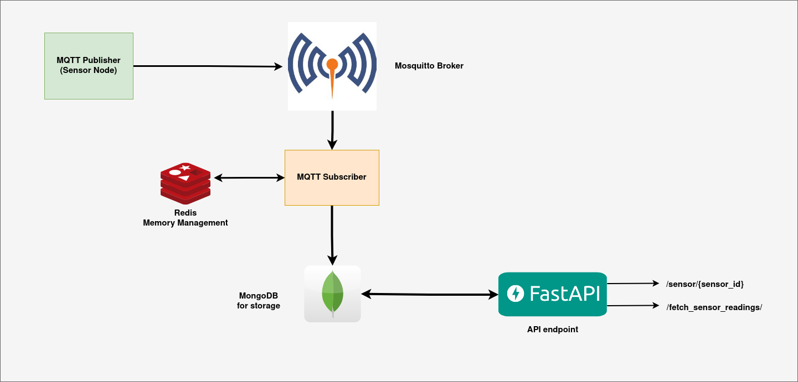

# IoT Simulation in Docker container




## Endpoint Reference 
Endpoint coming from fast api. The Fast API running on __8222__ port.
####  Endpoint to retrieve the last ten sensor readings for a specific sensor
```http
GET /sensor/{sensor_id}
```
| Parameter | Type     | Description |
| :-------- |:---------|:------------|
| `sensor_id` | `integer` |             |

####  Endpoint to fetch sensor readings by specifying a start and end range
```http
GET /fetch_sensor_readings/
```
| Parameter | Type     | Description                   |
|:----------| :------- |:------------------------------|
| `start`   | `string` | **Required**. Pass it in body |
| `end`     | `string` | **Required**. pass it in body |


### File Structure
```
.env
.gitignore
README.md
docker-compose.yml
docker
    |-- python_app
        |-- Dockerfile
        |-- entrypoint.sh
        |-- requirements.txt
    |-- python_publisher
        |-- Dockerfile
        |-- requirements.txt
    |-- python_subscriber
        |-- Dockerfile
        |-- requirements.txt
mosquitto
    |-- config
        |-- mosquitto.conf
python_app
    |-- app.py
python_publisher
    |-- mqtt_publisher.py
python_subscriber
    |-- db_save.py
    |-- mqtt_subscriber.py
```