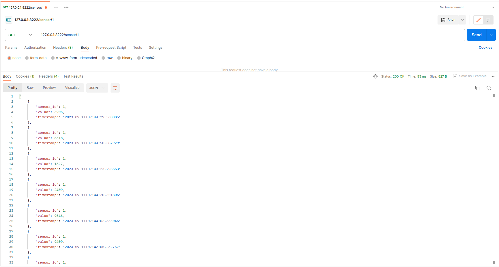
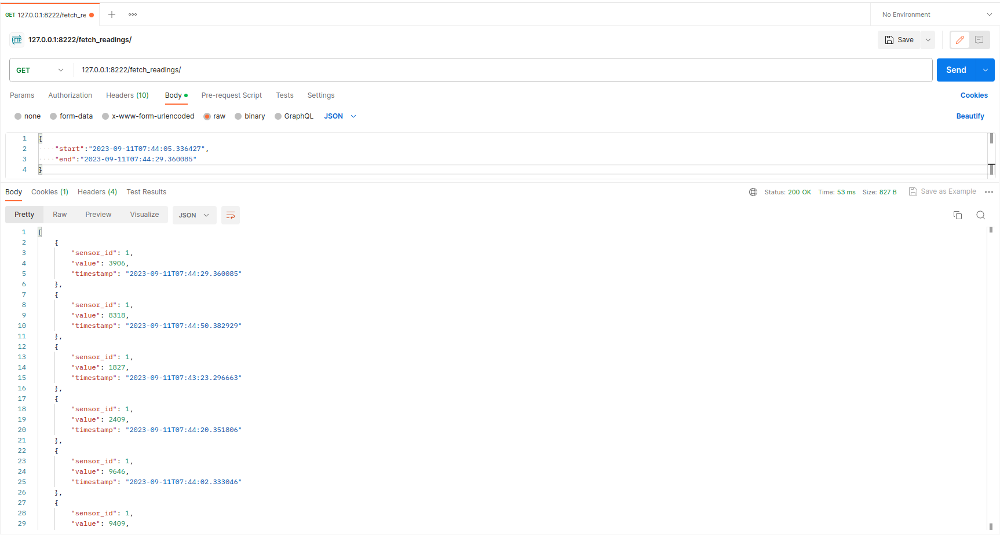
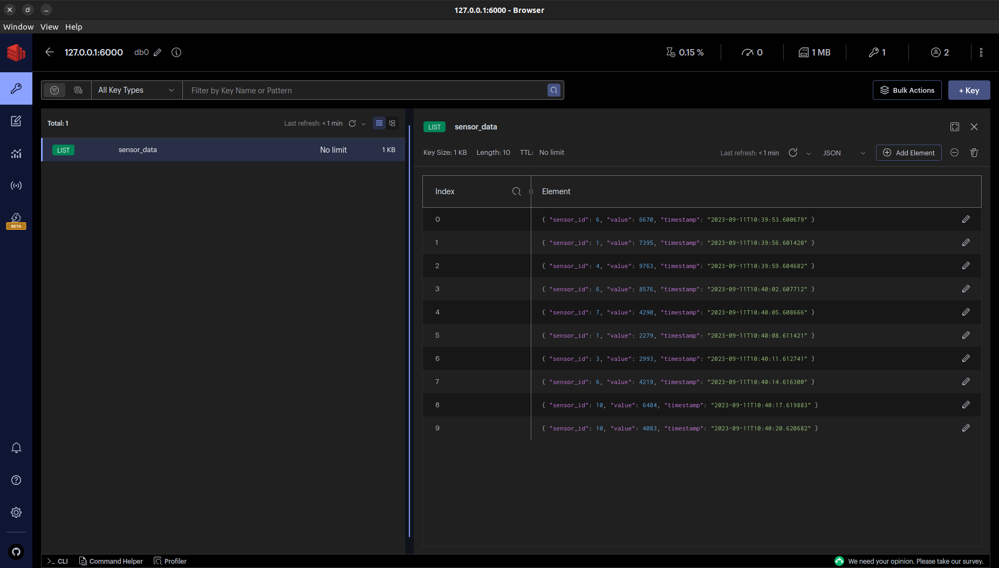

# IoT Simulation in Docker container


## Table of Contents
- [Project Overview](#project-overview)
- [Getting Started](#getting-started)
  - [Prerequisites](#prerequisites)
- [Services Overview](#services-overview)
- [Design Choices](#design-choices)
- [Challenges and Solutions](#challenges-and-solutions)

# Project-Overview

# Getting-Started
### File Structure
```
.env
.gitignore
README.md
docker-compose.yml
docker
    |-- python_app
        |-- Dockerfile
        |-- entrypoint.sh
        |-- requirements.txt
    |-- python_publisher
        |-- Dockerfile
        |-- requirements.txt
    |-- python_subscriber
        |-- Dockerfile
        |-- requirements.txt
mosquitto
    |-- config
        |-- mosquitto.conf
python_app
    |-- app.py
python_publisher
    |-- mqtt_publisher.py
python_subscriber
    |-- db_save.py
    |-- mqtt_subscriber.py
```
## Prerequisites
To work it properly need to use dokcer compose version 2.0 or above.

# Services Overview

.env file contains all credentials and it is used as 

### `python_publisher`

- **Description:** This service is responsible for publishing IoT sensor data to the MQTT broker. It is built from the Dockerfile located at `docker/python_publisher/Dockerfile`.
- **Volume:** It mounts the `./python_publisher` directory to `/var/www/python_publisher` inside the container.
- **Environment:** It uses environment variables defined in the `.env` file.
- **Working Directory:** The container's working directory is set to `/var/www/python_publisher`.
- **Networks:** It is part of the `iot-network`.
- **Dependencies:** This service does not depend on other services.

### `python_subscriber`

- **Description:** The subscriber service listens to MQTT topics and saves incoming data to a database. It is also built from the Dockerfile located at `docker/python_subscriber/Dockerfile`.
- **Volume:** It mounts the `./python_subscriber` directory to `/var/www/python_subscriber` inside the container.
- **Environment:** It uses environment variables defined in the `.env` file.
- **Working Directory:** The container's working directory is set to `/var/www/python_subscriber`.
- **Networks:** It is part of the `iot-network`.
- **Dependencies:** This service depends on both `mongo_db` and `redis_db`.

### `mosquitto`

- **Description:** This service runs the MQTT broker using the Eclipse Mosquitto image version 1.6.10.
- **Volume:** It mounts the configuration directory from `./mosquitto/config` to `/mosquitto/config` inside the container.
- **Ports:** It exposes MQTT broker on host port 8888, mapped to container port 1883.
- **Networks:** It is part of the `iot-network` with a specific IPv4 address.

### `python_app`

- **Description:** This service hosts a Fast API application that provides RESTful endpoints for accessing IoT sensor data.
- **Volume:** It mounts the `./python_app` directory to `/var/www/python_app` inside the container.
- **Environment:** It uses environment variables defined in the `.env` file.
- **Working Directory:** The container's working directory is set to `/var/www/python_app`.
- **Command:** It runs the `/entrypoint.sh` script.
- **Ports:** It exposes the Fast API application on host port 8222, mapped to container port 8200.
- **Dependencies:** This service depends on `mongo_db`.
####  Endpoint to retrieve the last ten sensor readings for a specific sensor
```http
GET /sensor/{sensor_id}
```
| Parameter | Type     | Description |
| :-------- |:---------|:------------|
| `sensor_id` | `integer` |          |



####  Endpoint to fetch sensor readings by specifying a start and end range
```http
GET /fetch_sensor_readings/
```
| Parameter | Type     | Description                   |
|:----------| :------- |:------------------------------|
| `start`   | `string` | **Required**. Pass it in body |
| `end`     | `string` | **Required**. pass it in body |



### `redis_db`

- **Description:** This service runs a Redis server using the "redis:alpine" image.
- **Ports:** It exposes the Redis server on host port 6000, mapped to container port 6379.

- 


### `mongo_db`

- **Description:** This service runs a MongoDB database using the "mongo:latest" image.
- **Environment:** It sets environment variables for database configuration.
- **Ports:** It exposes the MongoDB on host port 27017, mapped to container port 27017.
- **Volume:** It mounts a volume for data persistence at `/data/db`.
- **Networks:** It is part of the `iot-network`.
- **Healthcheck:** It has a health check configured.


## Endpoint Reference 
Endpoint coming from fast api. The Fast API running on __8222__ port.

### Redis data


## Design-Choices

## Challenges-and-Solutions