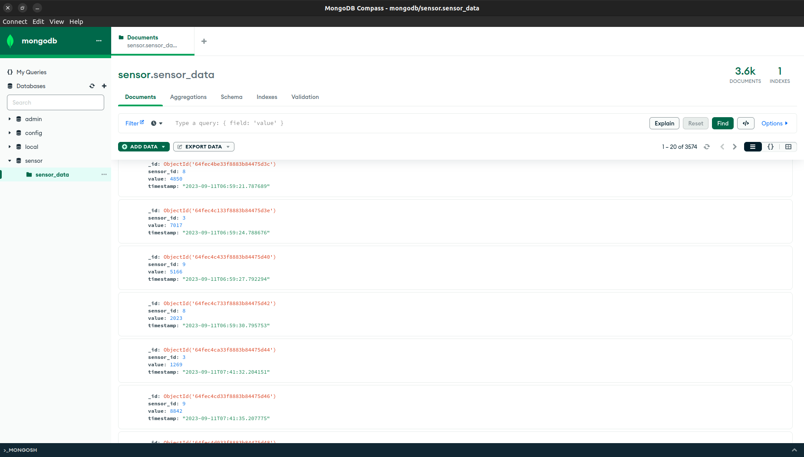

# IoT Simulation in Docker container


## Table of Contents
- [Project Overview](#project-overview)
  - [Key Objectives](#key-objectives)
- [Getting Started](#getting-started)
  - [Prerequisites](#prerequisites)
  - [File Structure](#file-structure)
- [Services Overview](#services-overview)
  - [Python Publisher](#pythonpublisher)
  - [Python Subscriber](#pythonsubscriber)
  - [Mosquitto](#mosquitto)
  - [Python App / Fast API App](#pythonapp)
  - [RedisDB](#redisdb)
  - [MongoDB](#mongodb)
- [Design Choices](#design-choices)
- [Challenges and Solutions](#challenges-and-solutions)

# Project-Overview
This project aims to simulate the behavior of sensors, monitor their readings, and provide APIs to 
retrieve data based on specific criteria.

## Key Objectives

- **MQTT Broker Setup:** Deploy a Mosquitto MQTT broker using Docker to facilitate communication between MQTT clients, including publishers and subscribers.

- **MQTT Publisher:** Create a Python MQTT client to simulate multiple sensor readings and publish them to MQTT topics such as `sensors/temperature` and `sensors/humidity`. The sensor data will be published in the following JSON format:

    ```json
    {
      "sensor_id": "unique_sensor_id",
      "value": "<reading_value>",
      "timestamp": "ISO8601_formatted_date_time"
    }
    ```

- **MQTT Subscriber:** Create a Python MQTT subscriber to receive sensor data messages and store them in a MongoDB collection.

- **Data Storage:** Initiate a MongoDB instance using Docker to serve as the primary data storage solution for the incoming MQTT messages.

- **In-Memory Data Management:** Implement Redis using Docker to efficiently store and manage the latest ten sensor readings in memory.

- **FastAPI Endpoint:** Design an API with the following endpoints to provide easy access to sensor data:

    - Sensor Readings by Range: An endpoint that allows users to fetch sensor readings by specifying a start and end range.

    - Last Ten Sensor Readings: An endpoint to retrieve the last ten sensor readings for a specific sensor, leveraging the in-memory Redis storage.

- **Docker Integration:** Integrate all services, including the MQTT broker, MQTT publisher, MQTT subscriber, MongoDB, Redis, and FastAPI, using Docker Compose for seamless deployment and orchestration.

# Getting-Started
To begin using this project, follow the steps below to configure the sensor simulation and monitoring environment.
## Prerequisites
1. To ensure proper functionality, it is required to use Docker Compose version 2.0 or a more recent version.
2. Add all required credentials in ```.env``` file.
## File Structure
```
.env
.gitignore
README.md
docker-compose.yml
docker
    |-- python_app
        |-- Dockerfile
        |-- entrypoint.sh
        |-- requirements.txt
    |-- python_publisher
        |-- Dockerfile
        |-- requirements.txt
    |-- python_subscriber
        |-- Dockerfile
        |-- requirements.txt
mosquitto
    |-- config
        |-- mosquitto.conf
python_app
    |-- app.py
python_publisher
    |-- mqtt_publisher.py
python_subscriber
    |-- db_save.py
    |-- mqtt_subscriber.py
```

### Directory and File Descriptions

- `.env`: Environment configuration file.
- `.gitignore`: Gitignore rules for excluding specific files and directories from version control.
- `docker-compose.yml`: Configuration file for Docker Compose.
- `docker`: Directory containing Docker-related files.
    - `python_app`: Directory for the Python application Docker container.
        - `Dockerfile`: Dockerfile for building the Python application container.
        - `entrypoint.sh`: Shell script to be executed when the container starts. It starts the FastAPI server.
        - `requirements.txt`: List of Python package dependencies.
    - `python_publisher`: Directory for the Python publisher Docker container.
        - `Dockerfile`: Dockerfile for building the Python publisher container.
        - `requirements.txt`: List of Python package dependencies.
    - `python_subscriber`: Directory for the Python subscriber Docker container.
        - `Dockerfile`: Dockerfile for building the Python subscriber container.
        - `requirements.txt`: List of Python package dependencies.
- `mosquitto`: Directory for Mosquitto MQTT broker configuration.
    - `config`: Configuration directory for Mosquitto.
        - `mosquitto.conf`: Configuration file for the Mosquitto MQTT broker.
- `python_app`: Directory for Python application source code.
    - `app.py`: Main Python application file.
- `python_publisher`: Directory for Python publisher source code.
    - `mqtt_publisher.py`: Python script for MQTT message publishing.
- `python_subscriber`: Directory for Python subscriber source code.
    - `db_save.py`: Python script for saving data received via MQTT.
    - `mqtt_subscriber.py`: Python script for MQTT message subscription.

    
# Services Overview


### `python_publisher`

- **Description:** This service is responsible for publishing IoT sensor data to the MQTT broker. It is built from the Dockerfile located at `docker/python_publisher/Dockerfile`.
- **Volume:** It mounts the `./python_publisher` directory to `/var/www/python_publisher` inside the container.
- **Environment:** It uses environment variables defined in the `.env` file.
- **Working Directory:** The container's working directory is set to `/var/www/python_publisher`.
- **Networks:** It is part of the `iot-network`.
- **Dependencies:** This service does not depend on other services.

### `python_subscriber`

- **Description:** The subscriber service listens to MQTT topics and saves incoming data to a database. It is also built from the Dockerfile located at `docker/python_subscriber/Dockerfile`.
- **Volume:** It mounts the `./python_subscriber` directory to `/var/www/python_subscriber` inside the container.
- **Environment:** It uses environment variables defined in the `.env` file.
- **Working Directory:** The container's working directory is set to `/var/www/python_subscriber`.
- **Networks:** It is part of the `iot-network`.
- **Dependencies:** This service depends on both `mongo_db` and `redis_db`.

### `mosquitto`

- **Description:** This service runs the MQTT broker using the Eclipse Mosquitto image version 1.6.10.
- **Volume:** It mounts the configuration directory from `./mosquitto/config` to `/mosquitto/config` inside the container.
- **Ports:** It exposes MQTT broker on host port 8888, mapped to container port 1883.
- **Networks:** It is part of the `iot-network` with a specific IPv4 address. Assigned static IP to simulate it as 

### `python_app`

- **Description:** This service hosts a Fast API application that provides RESTful endpoints for accessing IoT sensor data.
- **Volume:** It mounts the `./python_app` directory to `/var/www/python_app` inside the container.
- **Environment:** It uses environment variables defined in the `.env` file.
- **Working Directory:** The container's working directory is set to `/var/www/python_app`.
- **Command:** It runs the `/entrypoint.sh` script.
- **Ports:** It exposes the Fast API application on host port 8222, mapped to container port 8200.
- **Dependencies:** This service depends on `mongo_db`.

####  Endpoint to retrieve the last ten sensor readings for a specific sensor
```http
GET /sensor/{sensor_id}
```
| Parameter   | Type      | Description                      |
|:------------|:----------|:---------------------------------|
| `sensor_id` | `integer` | **Required**. It takes sensor id |


####  Endpoint to fetch sensor readings by specifying a start and end range
```http
GET /fetch_sensor_readings/
```
| Parameter | Type     | Description                   |
|:----------|:---------|:------------------------------|
| `start`   | `string` | **Required**. Pass it in body |
| `end`     | `string` | **Required**. pass it in body |


### `redis_db`

- **Description:** This service runs a Redis server using the "redis:alpine" image.
- **Ports:** It exposes the Redis server on host port 6000, mapped to container port 6379.


### `mongo_db`

- **Description:** This service runs a MongoDB database using the "mongo:latest" image.
- **Environment:** It sets environment variables for database configuration.
- **Ports:** It exposes the MongoDB on host port 27017, mapped to container port 27017.
- **Volume:** It mounts a volume for data persistence at `/data/db`.
- **Networks:** It is part of the `iot-network`.
- **Healthcheck:** It has a health check configured.



### Tools used to verify data in different stages 
The following tools are utilized for verifying the presence of data in the database and for testing API endpoints.
``` list
- Postman
- RedisInsight
- Mongodb Compass
```
## Design-Choices
### Framework and Library Selection
``` list
1. pymongo
2. fastapi
3. paho
4. redis
```

## Challenges-and-Solutions
1. During developing the project I faced issues related to storing data into redis and mongodb from MQTT subscriber end.
I was unable to store only latest 10 incoming data into redis and oldest data into mongodb. After doing few searching about
redis (python library) found out in the documentation that we can use ```rpush``` for storing data at end of the queue and
```lpop``` for removing data from head of the queue. 

2. During creating api endpoint for  ```/fetch_sensor_readings/```, this endpoint takes ```start``` and ```end``` datetime 
in body to fetch data. Initially I was facing issue because for datatype. 
``` python
class BodyData(BaseModel):
    start: str
    end: str
```
The solution I came up using BodyData class. Now we can pass datatime as string and can retrieve data from mongodb.